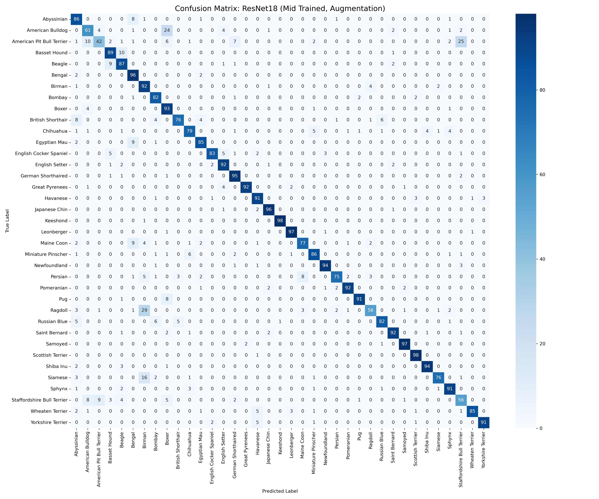
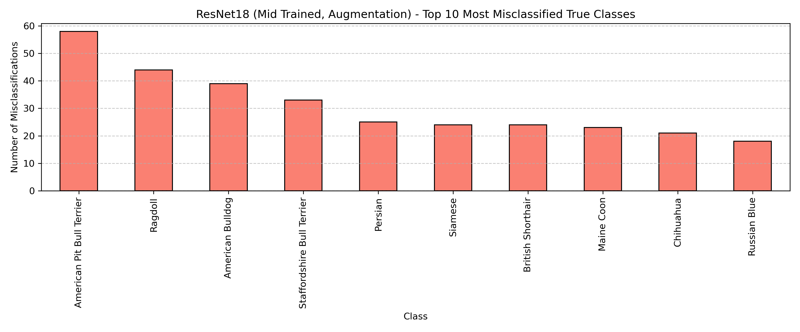
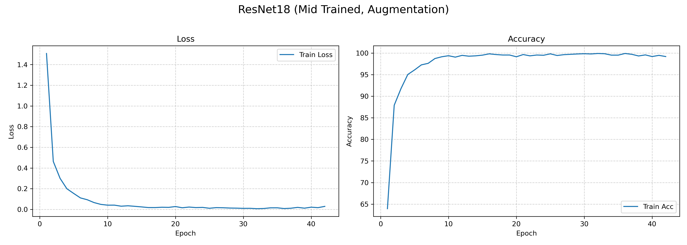

_Fine-Tuning and Comparing Pre-Trained CNN Architecture for Pet Breed Classification_
# MATH 392 Final Project

## Overview:
For this project, we will be fine-tuning and comparing at least two pre-trained CNN models to classify cat and dog images into 37 breeds. For our CNN models we will be using  **MoblieNetV3** and **ResNet18** to do the classification on the dataset Oxford-IIT Pet.

## Dataset Information
The **Oxford-IIIT Pet Dataset** dataset contains images of 37 different breeds of cats and dogs, with approximately 200 images per class. The images have a large variation in scale, pose, and lighting. Our goal is to classify an input image into one of these 37 pet breeds.

Below are two sample images from the Oxford-IIIT Pet Dataset:

<p align="center">
  <div align="center">
    <table>
      <tr>
        <td align="center">
          <br/>
          <sub>Beagle</sub>
        </td>
        <td align="center">
          <br/>
          <sub>Birman</sub>
        </td>
      </tr>
    </table>
  </div>
</p>

## Project Structure
- **assets/**: Images for ReadMe
- **data/**: Place the Oxford-IIIT Pet dataset here, or use scripts/notebooks to download it automatically.
- **notebooks/**: Interactive Jupyter notebooks for running the full pipeline or for exploratory analysis.
- **results/**: Stores model outputs such as evaluation metrics, predictions, training history and hpo history.
- **scripts/**: Command-line scripts for hyperparameter optimization, training, and evaluation.
- **README.md**: This documentation file.

## Result Summary
Overall, ResNet18 models consistently outperform MobileNetV2 models across all key metrics, with the best results achieved by the ResNet18 (Mid Trained, No Augmentation) configuration. The use of data augmentation and deeper fine-tuning (mid-layer training) further improves performance, particularly for challenging classes.

Class-wise analysis shows that distinct breeds such as Keeshond, Scottish Terrier, Samoyed, Leonberger, and Great Pyrenees achieve the highest F1-scores (above 94\%), indicating reliable recognition. In contrast, visually similar breeds—especially American Pit Bull Terrier, Staffordshire Bull Terrier, and American Bulldog—are the most challenging, with frequent misclassifications among them. Confusion matrices reveal strong diagonal dominance for well-recognized classes and significant off-diagonal confusion between similar breeds. Notably, American Pit Bull Terrier is most often misclassified as Staffordshire Bull Terrier and vice versa, highlighting the need for targeted improvements.

The most frequently misclassified classes are American Pit Bull Terrier, Ragdoll, American Bulldog, and Staffordshire Bull Terrier, with errors primarily due to visual similarity and class imbalance. Training and validation curves show effective learning and convergence for most models. Models with minimal gaps between training and validation performance demonstrate good generalization, while larger gaps suggest overfitting or underfitting.

To further improve performance, especially for hard-to-distinguish breeds, future work should focus on collecting more data for underrepresented classes, applying advanced augmentation techniques, and exploring specialized loss functions. Overall, the analysis demonstrates strong performance for many classes but also highlights persistent challenges with visually similar and minority classes. Addressing these will be key to achieving balanced and robust classification results.

### Comparative Performance of CNN Models on Oxford-IIIT Pet Dataset

| Model Name                                 | Macro Avg F1 | Weighted Avg F1 | Macro Precision | Macro Recall |
|--------------------------------------------|:------------:|:---------------:|:---------------:|:------------:|
| MobileNetV2 (Head Trained, Augmentation)   |    74.82     |      74.89      |      75.73      |    74.97     |
| MobileNetV2 (Mid Trained, No Augmentation) |    79.11     |      79.18      |      79.71      |    79.35     |
| MobileNetV2 (Head Trained, No Augmentation)|    73.11     |      73.17      |      73.69      |    73.14     |
| MobileNetV2 (Mid Trained, Augmentation)    |    80.40     |      80.45      |      81.14      |    80.50     |
| ResNet18 (Mid Trained, No Augmentation)    |    88.92     |      88.97      |      89.29      |    89.04     |
| ResNet18 (Head Trained, Augmentation)      |    84.21     |      84.29      |      85.32      |    84.15     |
| ResNet18 (Head Trained, No Augmentation)   |    86.78     |      86.84      |      87.32      |    86.81     |
| ResNet18 (Mid Trained, Augmentation)       |    85.49     |      85.55      |      86.43      |    85.69     |


#### Visualizations of Model Performance

Below are key visualizations illustrating the performance of the best ResNet18 model (Mid Trained, Augmentation):


<p align="center">
  <br/>
  <sub>Confusion Matrix for ResNet18 </sub>
</p>

<p align="center">
  <br/>
  <sub>Most Frequent Misclassifications</sub>
</p>

<p align="center">
  <br/>
  <sub>Training and Validation Curves</sub>
</p>


## Detailed Usage
This project implements a robust, reproducible pipeline for benchmarking transfer learning strategies on fine-grained pet breed classification. The approach systematically explores the impact of model architecture, layer unfreezing depth, and data augmentation on classification performance, using a fully automated, script-driven workflow.

### Experimental Factors

Each experiment is uniquely defined by a `setup_id` in the format: `modelname_unfreezekey_augmentstr`. The 8 experimental setups comprehensively cover:

1. **Model Architecture:**  
  - `resnet`: ResNet18  
  - `mobilenet`: MobileNetV3-Small

2. **Unfreezing Strategy:**  
  - `head`: Only the classification head is trained (feature extraction).  
  - `mid`: The head and a moderate portion of the backbone are unfrozen.  

3. **Data Augmentation:**  
  - `aug`: Advanced on-the-fly augmentations (random crops, flips, color jitter, rotations).  
  - `noaug`: Standard resizing and normalization only.

This factorial design enables a rigorous comparison of transfer learning strategies, supporting data-driven recommendations for model deployment.

### Automated Three-Stage Pipeline

The workflow is fully automated and modular, supporting scalable experimentation and reproducibility:

1. **Hyperparameter Optimization (HPO):**  
  For each setup, a grid search is performed over learning rates and weight decay, using a validation split. All trial results and the best configuration are logged for transparency and future reference.

2. **Final Model Training:**  
  The optimal hyperparameters are used to train each model on the full training set, with early stopping to prevent overfitting. Training histories and best model weights are saved for auditability.

3. **Evaluation:**  
  Each trained model is evaluated on a held-out test set, with detailed metrics (accuracy, precision, recall, F1-score, confusion matrix) and per-sample predictions exported for downstream analysis.

All scripts are parameterized for batch execution, enabling efficient scaling across multiple experimental conditions. Results are organized in a structured directory hierarchy for seamless integration with analysis notebooks and reporting tools.

### Key Technical Assets

- **Configurable Python Scripts:**  
  Modular scripts (`run_hpo.py`, `run_final_training.py`, `run_evaluation.py`) orchestrate each stage, with robust argument parsing for flexible experimentation.

- **Centralized Configuration:**  
  All hyperparameter grids, unfreezing maps, and directory paths are managed in `config.py` for maintainability.

- **Reusable Utilities:**  
  Shared logic for data loading, model preparation, and augmentation is encapsulated in `utils.py`, promoting code reuse and consistency.

- **Jupyter Notebooks:**  
  Interactive notebooks support exploratory analysis and visualization of results, facilitating rapid insights and presentation-ready figures.

### Example Usage

The pipeline is designed for ease of use and reproducibility. For example, to run HPO, final training, and evaluation for a given setup:

```bash
python run_hpo.py --setup_ids resnet_mid_aug --hpo_epochs 12 --batch_size 32
python run_final_training.py --setup_ids resnet_mid_aug --final_train_epochs 50 --batch_size 32 --patience 10
python run_evaluation.py --setup_ids resnet_mid_aug
```


## Quick Start Guide

Everything you need is included in the repo and ready to run in Google Colab with GPU enabled.

### 1. Clone the Repository

git clone
cd MATH392_Final_Project

### 2. Run Hyperparameter Optimization
python scripts/run_hpo.py \
  --config configs/<SETIDs> \
  --epochs: 20
  --batch_size 64

### 3. Train the Final Model
Once the best hyperparameters are known, train your model with:
python scripts/run_train.py \
  --config configs/<SETIDs> \
  --batch_size 64
  --epochs 20 
  --lr 1e-4

### 4. Evaluate the Final Model
To evaluate the trained model, pass in the config and final checkpoint file:
python scripts/run_evaluation.py \
  --config configs/<SETIDs> \
  --checkpoint results/final_training/<SETIDs>/model_best.pth

### 5. Or Use the Jupyter Notebook
You can also run the entire pipeline from within a notebook:
notebooks/fine_tuning.ipynb


